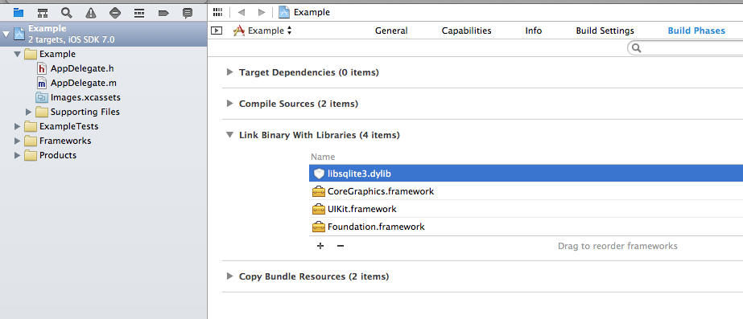
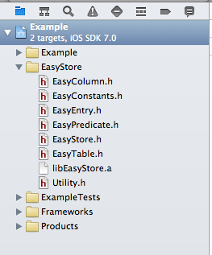

EasyStore
=========

A lightweight object oriented local storage library for Objective C.

##Installation
1. Add a link to the libsqlite3.dylib library

2. Copy the EasyStore static library and header files into your project  
(All files located in Installation/EasyStore)  

##Creating a Database with Tables

	#import "EasyStore.h"
	
	[EasyStore beginDatabaseCreation];
	
	EasyTable *table = [EasyStore createTableWithName:@"Users"];
    
    [table createStringColumnWithName:@"name"];
    [table createIntegerColumnWithName:@"age"];
    [table createBooleanColumnWithName:@"retired"];
    
    [EasyStore completeDatabaseCreation];

##Insert Data into a Table

	EasyEntry* entry = [EasyEntry new];
    [entry setString:@"Bob" forColumnName:@"name"];
    [entry setInteger:68 forColumnName:@"age"];
    [entry setBoolean:true forColumnName:@"retired"];
    
    [EasyStore store:entry intoTable:@"Users"];

## Querying a Table

 	EasyPredicate *predicate = [EasyPredicate new];
    [predicate selectFromTable:@"Users"];
    [predicate whereColumn:@"age" isGreaterThanInteger:65];
    [predicate andColumnIsFalse:@"retired"];
    
    NSArray* entries = [EasyStore selectEntriesWithPredicate:predicate];
    for(EasyEntry *entry in entries){
    	NSString *name = [entry getNameForColumn:@"name"];
    	int age = [entry getIntegerForColumn:@"age"];
    	bool retired = [entry getBooleanForColumn:@"retired"];
    }
    
    // Get all data from a table
    entries = [EasyStore selectAllEntriesForTable:@"Users"];
	
## Keys
#### Add Identity column

Creates an autoincrementing primary key with the column name "id".

    [EasyStore beginDatabaseCreation];
    
    EasyTable *table = [EasyStore createTableWithName:@"Students"];
    
    [table addIdentityColumn];
    [table createStringColumnWithName:@"name"];
    [table createFloatColumnWithName:@"gpa"];
    
    [EasyStore completeDatabaseCreation];

#### Set custom column to Identity column

    [EasyStore beginDatabaseCreation];
    
    EasyTable *table = [EasyStore createTableWithName:@"TV_Shows"];
    
    [[table createIntegerColumnWithName:@"identifier"] setAsIdentityColumn];
    [table createStringColumnWithName:@"name"];
    [table createDateColumnWithName:@"airingTime"];
    
    [EasyStore completeDatabaseCreation];

#### Add primary key

    [EasyStore beginDatabaseCreation];
    
    EasyTable *table = [EasyStore createTableWithName:@"Cities"];
    
    [[table createStringColumnWithName:@"name"] setAsPrimaryKey];
    [table createFloatColumnWithName:@"latitude"];
    [table createFloatColumnWithName:@"longitude"];
    
    [EasyStore completeDatabaseCreation];

## Query Modifiers
#### Limit
#### Offset
#### Orderby

## Invoking Raw SQL Queries
EasyStore is a wrapper around SQLite, so raw queries can be used as well.

## Retrieving SQL Errors
(TODO)

## Supported Data Types
(TODO)
 

