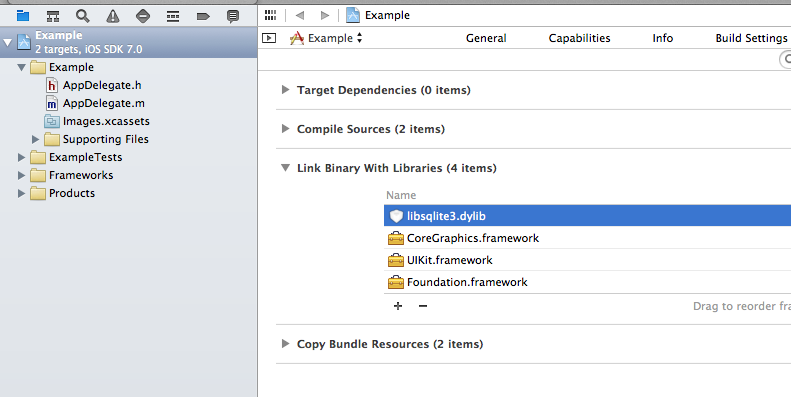
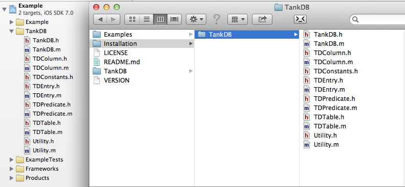

TankDB
=========

A lightweight object oriented local storage library for Objective C.

##Installation
1. Add a link to the libsqlite3.dylib library

2. Copy the TankDB source files into your project

##Creating a Database with Tables

	#import "TankDB.h"
	
	[TankDB beginDatabaseCreation];
	
	TDTable *table = [TankDB createTableWithName:@"Users"];
    
    [table createStringColumnWithName:@"name"];
    [table createIntegerColumnWithName:@"age"];
    [table createBooleanColumnWithName:@"retired"];
    
    [TankDB completeDatabaseCreation];

##Insert Data into a Table

	TDEntry* entry = [TDEntry new];
    [entry setString:@"Bob" forColumn:@"name"];
    [entry setInteger:68 forColumn:@"age"];
    [entry setBoolean:true forColumn:@"retired"];
    
    [TankDB insert:entry intoTable:@"Users"];

## Querying a Table

 	TDPredicate *predicate = [TDPredicate new];
    [predicate selectFromTable:@"Users"];
    [predicate whereColumn:@"age" isGreaterThanInteger:65];
    [predicate andColumnIsFalse:@"retired"];
    
    NSArray* entries = [TankDB selectEntriesWithPredicate:predicate];
    for(TDEntry *entry in entries){
    	NSString *name = [entry stringForColumn:@"name"];
    	int age = [entry integerForColumn:@"age"];
    	bool retired = [entry booleanForColumn:@"retired"];
    }
    
    // Get all data from a table
    entries = [TankDB selectAllEntriesForTable:@"Users"];
	
## Keys
#### Add Identity column

Creates an autoincrementing primary key with the column name "id".

    [TankDB beginDatabaseCreation];
    
    TDTable *table = [TankDB createTableWithName:@"Students"];
    
    [table addIdentityColumn];
    [table createStringColumnWithName:@"name"];
    [table createFloatColumnWithName:@"gpa"];
    
    [TankDB completeDatabaseCreation];

#### Set custom column to Identity column

    [TankDB beginDatabaseCreation];
    
    TDTable *showsTable = [TankDB createTableWithName:@"TV_Shows"];
    [[showsTable createIntegerColumnWithName:@"identifier"] setAsIdentityColumn];
    [showsTable createStringColumnWithName:@"name"];
    [showsTable createDateColumnWithName:@"airingTime"];
    
    TDTable *metaDataTable = [TankDB createTableWithName:@"TV_Meta_Data"];
    [metaDataTable createIntegerColumnWithName:@"tv_identifier"];
    [metaDataTable createStringColumnWithName:@"station"];
    [metaDataTable createIntegerColumnWithName:@"views"];
    
    [TankDB completeDatabaseCreation];

#### Add primary key

    
    [TankDB beginDatabaseCreation];
    
    TDTable *table = [TankDB createTableWithName:@"Cities"];
    [[table createStringColumnWithName:@"name"] setAsPrimaryKey];
    [table createFloatColumnWithName:@"latitude"];
    [table createFloatColumnWithName:@"longitude"];
    
    [TankDB completeDatabaseCreation];

## Query Modifiers

#### Limit
	TDPredicate *predicate = [TDPredicate new];
    [predicate selectFromTable:@"results"];
    [predicate withLimit:5];
    
    NSArray* entries = [TankDB selectEntriesWithPredicate:predicate];
    
#### Offset
    TDPredicate *predicate = [TDPredicate new];
    [predicate selectFromTable:@"pagedResults"];
    [predicate withLimit:20 andOffset:5];
    
    NSArray* entries = [TankDB selectEntriesWithPredicate:predicate];

#### Order By Ascending

	TDPredicate *predicate = [TDPredicate new];
    [predicate selectFromTable:@"Words"];
    [predicate orderAscendingByColumn:@"word"];
    
    NSArray* entries = [TankDB selectEntriesWithPredicate:predicate];
    
#### Order by Descending
    TDPredicate *predicate = [TDPredicate new];
    [predicate selectFromTable:@"Numbers"];
    [predicate orderDescendingByColumn:@"number"];
    
    NSArray* entries = [TankDB selectEntriesWithPredicate:predicate];

## Invoking Raw SQL Queries

	// Insert, Update, Delete
	[EasyStore invokeRawQuery:@"INSERT INTO Words VALUES ( \"hello\" )"];
	
	// Delect, Count
	NSArray* entries = [TankDB invokeRawSelectQuery:@"SELECT * FROM Contacts"];

## Retrieving SQL Errors
    [TankDB beginDatabaseCreation];
    
    TDTable *table = [TankDB createTableWithName:@"Users"];
    [table createStringColumnWithName:@"name"];
    [table createIntegerColumnWithName:@"age"];
    
    [TankDB completeDatabaseCreation];
    
    if([TankDB getStatus] == TD_OK){
    	// All is good
    }else{
        // An error occurred
    	NSLog(@"SLQ error message: %@", [TankDB getErrorMessage]);
    }

## Supported Data Types*
    Integer	-	[table createIntegerColumnWithName:@"name"];
    String	-	[table createStringColumnWithName:@"name"];
    Float	-	[table createFloatColumnWithName:@"name"];
    Boolean	-	[table createBooleanColumnWithName:@"name"];
    Date	-	[table createDateColumnWithName:@"name"];
 

